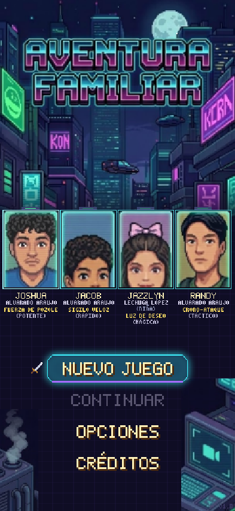
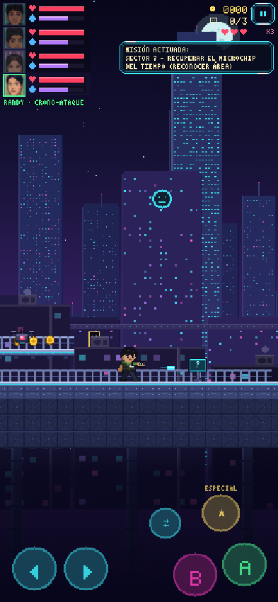
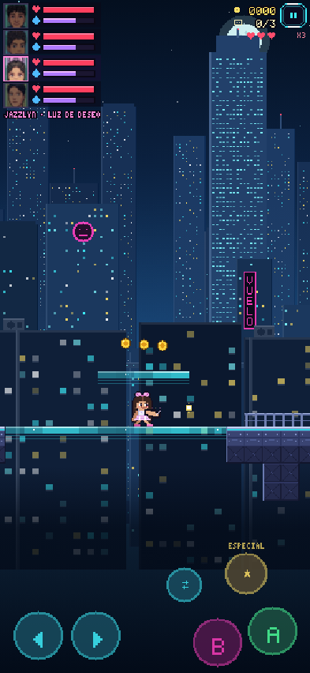
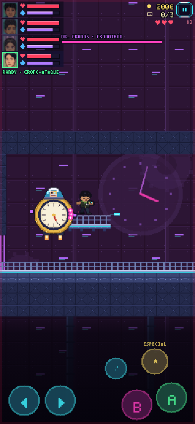

# Aventura Familiar

Videojuego de plataformas en **pixel-art neón** para teléfonos móviles. Joshua, Jacob,
Jazzlyn y Randy recorren el Sector 7 para recuperar el **Microchip del Tiempo** que
robó el Dr. Cronos de Chrono-Corp.

<p>
  
  
  
  
</p>

La portada, las cartas de los personajes, los retratos del HUD y la escena de la
misión salen de las imágenes originales del proyecto. El resto (sprites, enemigos,
ciudad con paralaje, música y efectos de sonido) se genera por código, así que el
juego pesa menos de 2 MB y funciona sin internet.

## Cómo jugar en el teléfono

El juego es una página web (HTML5). No necesita instalación ni tienda de aplicaciones.

1. **Publícalo** en cualquier hosting estático. Con GitHub Pages:
   *Settings → Pages → Deploy from a branch*, elige la rama y la carpeta raíz.
   El juego quedará en `https://<usuario>.github.io/<repositorio>/aventura-familiar/`.
2. **Ábrelo en el teléfono** (Chrome en Android o Safari en iPhone).
3. **Instálalo**: menú del navegador → *Agregar a pantalla de inicio* / *Instalar app*.
   Se abre a pantalla completa, en vertical, y funciona sin conexión.

Para probarlo en la computadora: `npx http-server aventura-familiar` y abre
`http://localhost:8080`.

### Convertirlo en APK de Android (opcional)

Con [Capacitor](https://capacitorjs.com/) y Android Studio instalados:

```bash
npm init -y
npm install @capacitor/core @capacitor/cli @capacitor/android
npx cap init "Aventura Familiar" com.familia.aventura --web-dir aventura-familiar
npx cap add android
npx cap open android   # en Android Studio: Build → Build APK
```

## Controles

| Táctil | Teclado | Acción |
|---|---|---|
| ◀ ▶ (abajo a la izquierda, puedes deslizar el dedo) | ← → / A D | Moverse |
| **A** | Espacio / ↑ / Z | Saltar (mantén para saltar más alto) |
| **B** | X / J | Atacar |
| **★** | C / L | Poder especial (gasta energía) |
| **⇄** o tocar un retrato del HUD | Q / Shift / 1-4 | Cambiar de personaje |
| ⏸ (arriba a la derecha) | Esc / P | Pausa |

## La familia

| Personaje | Poder | Ataque (B) | Especial (★) |
|---|---|---|---|
| **Joshua** Alvarado Araujo | Fuerza de Pozole (potente) | Puñetazo que rompe bloques agrietados | *Explosión de Pozole*: onda que daña a todos y rompe bloques |
| **Jacob** Alvarado Araujo | Sigilo Veloz (rápido) | Patada veloz; tiene **doble salto** | *Sigilo Veloz*: embestida invisible que atraviesa enemigos |
| **Jazzlyn** Lechuga López | Luz de Deseo (mágica) | Estrellas que persiguen al enemigo; **planea** y hace visibles los **puentes de luz** | *Luz de Deseo*: cura a toda la familia y daña alrededor |
| **Randy** Alvarado Araujo | Crono-Ataque (táctico) | Disparo de largo alcance | *Crono-Ataque*: detiene el tiempo 4 s; los láseres se apagan y los enemigos reciben el doble de daño |

Cada personaje tiene su propia vida (♥) y energía (gota). Si uno cae, la familia
pierde una vida y vuelve a la última antena. Los obstáculos están pensados para
usar a cada miembro: bloques agrietados (Joshua), paredes altas (Jacob), puentes de
luz y abismos largos (Jazzlyn) y barreras láser (Randy).

## Contenido

- **5 misiones** en el Sector 7: Calles de Neón, Puentes Elevados, Mercado Nocturno,
  Torre Chrono-Corp y el Núcleo del Tiempo, con jefe final de 3 fases (Dr. Cronos y su
  Cronotrón).
- **Historia** con diálogos y escena de introducción, pelea de jefe y final.
- **3 fotos familiares escondidas** por misión (12 en total) y récord de tiempo.
- **Enemigos**: drones, robo-guardias, torretas y agentes de Chrono-Corp.
- **Objetos**: chips (moneda), baterías de energía, pozole (salud), antenas de control,
  resortes y plataformas móviles.
- **Taller**: gasta chips en mejoras permanentes de salud, energía, fuerza y vidas.
- **Guardado automático** en el teléfono (botón *Continuar*).
- **Opciones**: volumen de música y efectos, vibración, tamaño de botones y pantalla
  completa.
- Música chiptune original para título, mapa, niveles, jefe y final.
- Funciona en vertical (recomendado) y en horizontal.

## Estructura

```
aventura-familiar/
├── index.html              página del juego
├── manifest.webmanifest    instalación como app (PWA)
├── sw.js                   caché para jugar sin internet
├── assets/                 recortes de las imágenes originales e íconos
├── capturas/               capturas para este documento
├── herramientas/
│   └── validar-niveles.js  revisa que los mapas se puedan completar
└── js/
    ├── motor.js      utilidades, fuente pixel, controles, audio y guardado
    ├── arte.js       sprites, casillas y fondos generados por código
    ├── niveles.js    personajes, historia y mapas de las misiones
    ├── ui.js         paneles, botones y diálogos
    ├── entidades.js  familia, enemigos, jefe, proyectiles y objetos
    ├── juego.js      escena de juego: física, cámara, HUD y poderes
    ├── escenas.js    título, intro, mapa, taller, opciones, créditos y final
    └── main.js       arranque, escalado a la pantalla y bucle principal
```

### Editar o crear niveles

Los mapas están en `js/niveles.js` como texto, un carácter por casilla (la leyenda
completa está al principio del archivo). Cada nivel se arma con trozos de 10 o 16
filas. Después de editarlos, ejecuta:

```bash
node aventura-familiar/herramientas/validar-niveles.js
```

El validador revisa el ancho de las filas, que haya inicio y meta, las 3 fotos, los
letreros, y hace una prueba aproximada de que la meta y las fotos se pueden alcanzar
con los poderes de la familia.
